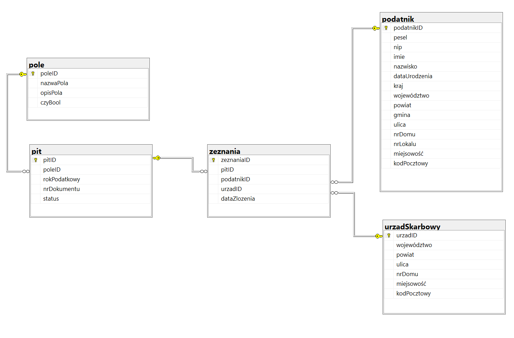

# BazyEntityFramework
Tworzenie aplikacji bazodanowej z użyciem podejścia Code First

## Określenie celu systemu - podstawowe pytanie: „Po co?”
  Celem elektronicznego systemu deklaracji podatkowych jest umożliwienie, podatnikom czy płatnikom ułatwić komunikowanie się z urzędem skarbowym. 

## Rozpoznanie obszarów krytycznych - od czego zależy powodzenie?
  Najważniejszy aspekt całego systemu to umożliwienie przekazywania, przechowywania i przetwarzania deklaracji podatkowych i podań w postaci elektronicznej oraz zapewnienie dostępu do informacji podatkowych on-line.
  
Podatki to nieunikniona część świata rzeczywistego, dlatego elektroniczny system powinien z góry być skazany na sukces.
  
Większa część społeczeństwa zyska na takim systemie m.in. poprawi się jakość obsługi podatników, skróci się czas oczekiwania na rozwiązanie spraw podatkowych czy umożliwi uzyskanie informacji o statusie spraw, zcentralizuje się dane o wszystkich podatnikach.

## Definicja wymagań - co należy zrobić i jak zmierzyć efekty tych działań?
- Obsługa deklaracji CIT PIT VAT NIP PCC.
- Obsługa dokumentów innych niż deklaracje (np. podania).
- Sprawdzanie stanu sprawy.
- Dostęp do informacji o stanie rozliczeń podatnika.
- Aktualizacja danych o podmiocie.
- Potwierdzenia danych identyfikacyjnych podmiotu.
- Portal informacyjny i informacja dedykowana
- Centralny Rejestr Podmiotów jako rejestr referencyjny.

## Ocena wartości różnych rozwiązań
#### Wymagania funkcjonalne systemu:
- Możliwość przeprowadzania operacji CRUD 
- Ograniczenie dostępu do danych zależnie od uprawnień użytkownika
- Analiza danych i sporządzanie statystyk
#### Wymagania niefunkcjonalne systemu: 
- Relacyjna baza danych
- Kontrola zgodności danych
- Zabezpieczenie przed powtarzaniem się danych
- Możliwość korzystania przez wiele osób jednocześnie

## Oszacowanie ryzyka
System bazy danych powinien bezkonfliktowo pozwalać na pracę wielu osób jednocześnie, posiadać częste kopie zapasowe, kontrolować spójność i unikalność wprowadzanych danych oraz ograniczać dostęp do danych wedle uprawnień.

## Schemat bazy danych

